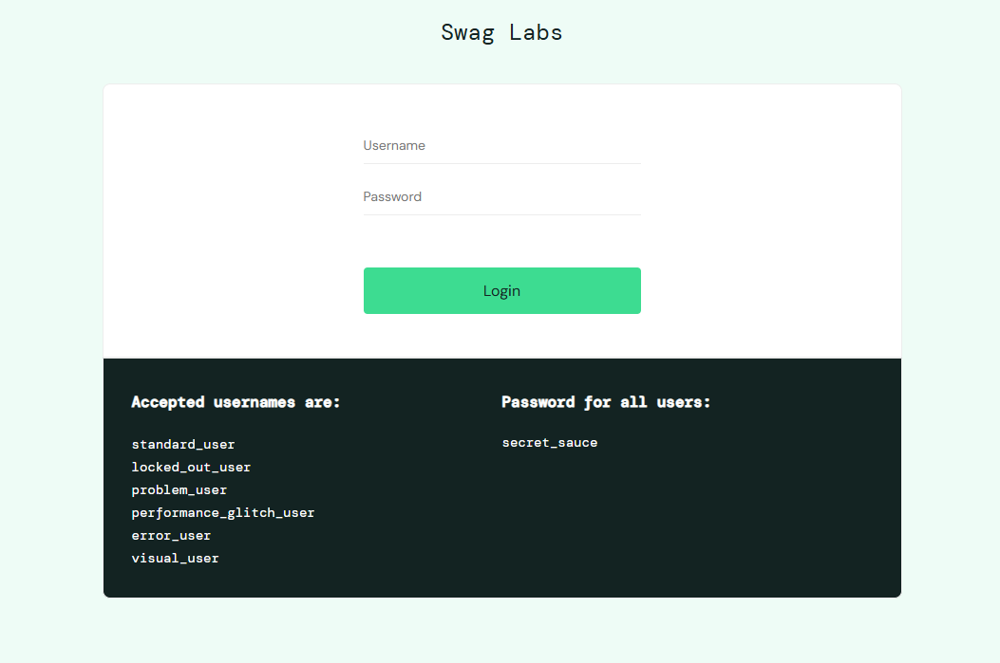
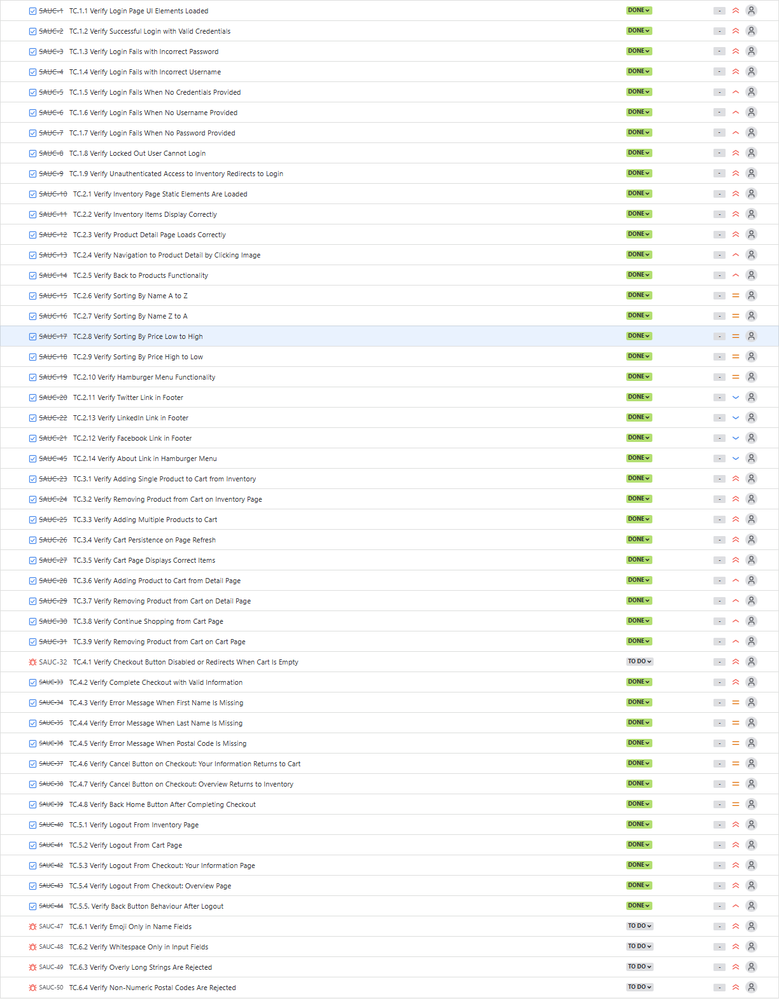

# SauceDemo E2E Testing Project
<details>
<summary>Table of Contents</summary>

- 📰 [About The Project](#about-the-project)  
- 🛠️ [Built With](#built-with)  
- 🚀 [Getting Started](#getting-started)  
- 🗂️ [Project Structure](#project-structure)  
- 🧪 [Test Cases](#test-cases)  
- 📊 [Jira Board](#jira-board)  
- 📄 [License](#license)   

</details>

---

## <a id="about-the-project"></a>📰 About The Project



A Cypress-based QA suite that automates and verifies SauceDemo’s critical workflows using the **standard_user** account.


## <a id="built-with"></a>🛠️ Built With

- [Cypress](https://www.cypress.io/)  
- [JavaScript](https://developer.mozilla.org/docs/Web/JavaScript)  
- [Node.js](https://nodejs.org/)   


## <a id="getting-started"></a>🚀 Getting Started

### Dependencies

<p align="left">
  
  
  
  
  
  
  
</p>

### Installation

1. **Clone the repo**  
   ```bash
   git clone https://github.com/Doncyys/saucedemo-e2e.git
   cd saucedemo-e2e
2. **Install dependencies**  
   ```bash
   npm install
   ```
3. **Run Cypress**  
   ```bash
   npm run cyr
   ```

---

## <a id="project-structure"></a>📁 Project Structure

```
saucedemo-e2e/
├── cypress/
│   ├── e2e/
│   │   ├── cart.cy.js
│   │   ├── checkout.cy.js
│   │   ├── inventory.cy.js
│   │   ├── login.cy.js
│   │   ├── logout.cy.js
│   │   └── negative.cy.js
│   ├── fixtures/
│   └── support/
│       ├── commands.js
│       └── e2e.js
├── docs/
│   ├── jira.png
    ├── login-page.png
│   └── TestCases.md
├── node_modules/
├── cypress.config.js
├── package.json
└── README.md
```

---

## <a id="test-cases"></a>🧪 Test Cases

See [TestCases](./docs/TestCases.md) for full list of scenarios and steps:

- [**TS.1** Login & Authentication](./docs/TestCases.md#ts1)
- [**TS.2** Product Browsing & Sorting](./docs/TestCases.md#ts2)
- [**TS.3** Cart Operations](./docs/TestCases.md#ts3)
- [**TS.4** Checkout & Order Flow](./docs/TestCases.md#ts4)
- [**TS.5** Logout & Session Management](./docs/TestCases.md#ts5)
- [**TS.6** Negative & Edge Cases](./docs/TestCases.md#ts6)
---

## <a id="jira-board"></a>📊 Jira Board

All test cases are tracked in a Jira Sprint:

<p align="center">
  
</p>


---

## <a id="license"></a>📄 License

This project is for educational purposes only.  
SauceDemo is owned and maintained by [Sauce Labs](https://saucelabs.com/).